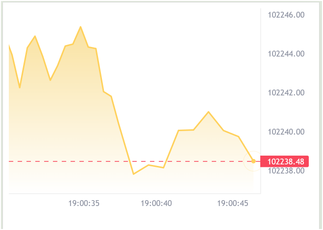

# k-line-chart

一个使用vue3和lightweight-charts的秒k线组件

## 功能

1、支持自定义lightweight-charts全部配置

2、自适应屏幕分辨率，宽度、高度自适应

3、支持价格精度控制

4、过滤插针数据，减少小尖角

# 示意图


<video autoplay="true" controls="controls"  src="https://private-user-images.githubusercontent.com/28807436/396122293-1e1eeaa9-4af7-40f5-b91a-0e5c1bf8671b.mp4?jwt=eyJhbGciOiJIUzI1NiIsInR5cCI6IkpXVCJ9.eyJpc3MiOiJnaXRodWIuY29tIiwiYXVkIjoicmF3LmdpdGh1YnVzZXJjb250ZW50LmNvbSIsImtleSI6ImtleTUiLCJleHAiOjE3MzQzNTc3NjUsIm5iZiI6MTczNDM1NzQ2NSwicGF0aCI6Ii8yODgwNzQzNi8zOTYxMjIyOTMtMWUxZWVhYTktNGFmNy00MGY1LWI5MWEtMGU1YzFiZjg2NzFiLm1wND9YLUFtei1BbGdvcml0aG09QVdTNC1ITUFDLVNIQTI1NiZYLUFtei1DcmVkZW50aWFsPUFLSUFWQ09EWUxTQTUzUFFLNFpBJTJGMjAyNDEyMTYlMkZ1cy1lYXN0LTElMkZzMyUyRmF3czRfcmVxdWVzdCZYLUFtei1EYXRlPTIwMjQxMjE2VDEzNTc0NVomWC1BbXotRXhwaXJlcz0zMDAmWC1BbXotU2lnbmF0dXJlPTljMDA0M2NjNDA5Mjg0MTYzNTRlNjEyMjg3NjNjMWY5MTNhMjE0ZWE1NTdhZjFlNmI1MzA1ZDRlMWU5MGQ0NGYmWC1BbXotU2lnbmVkSGVhZGVycz1ob3N0In0.ML-8GYKK7iPWBSaj_Bv7PyYlr523JzcBaUyye9-pWb8" title="asstes/sline2024.mp4"></video>
</video>

# 使用方式

## 1. 安装

`npm i k-line-chart`

## 2. 引用

```javascript
import Vue from 'vue'
import kLineChart from 'k-line-chart'
// 全局引用
Vue.use(kLineChart)
```

```vue
<!-- 组件引用 -->
<script setup lang="ts">
import kLineChart from '@/components/kLineChart.vue'
</script>
```

## 3.调用

示例：example/App.vue

```vue
<kLineChart :list="historyList" :newData="newData"></kLineChart>
```
